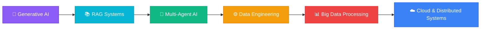

<div align="center">

<!-- Animated Wave Header -->


# Hi, I'm Omkar Gangamwar 👋

### AI & Data Enthusiast | Python Developer | Data & Backend Engineering

<br/>

<!-- Typing Animation -->
<a href="https://git.io/typing-svg"></a>

</div>

<br/>

<!-- About Section -->
## 👨‍💻 &nbsp;About Me

```yaml
name: Omkar Gangamwar
education: B.Tech in Artificial Intelligence
location: India
focus: Python → Data → AI/ML → Data Engineering → Backend

current_status:
  learning: [ "Apache Spark", "Kafka", "Airflow", "RAG", "Multi-Agent AI", "Cloud" ]
  building: "AI-powered systems with large-scale data pipelines"
  exploring: "How AI can work with distributed data — not just isolated models"
  looking_for: "Opportunities in Software Dev, Python, Data Engineering & AI/ML"
```

<br/>

<!-- What I'm focused on -->
<table align="center">
<tr>
<td width="50%" valign="top">

### 🎯 &nbsp;What Drives Me
- 🐍 &nbsp;Python development & automation
- 🗄️ &nbsp;SQL, PostgreSQL & data analysis
- 🤖 &nbsp;Machine Learning, Deep Learning, NLP & GenAI
- ⚙️ &nbsp;Data Engineering & Big Data technologies
- 🌐 &nbsp;Backend applications with Node.js & Flask
- 📊 &nbsp;Dashboards & analytics with Power BI
- 🔍 &nbsp;AI-powered systems for industry problems

</td>
<td width="50%" valign="top">

### 🧩 &nbsp;Problems I Enjoy
- 🔄 &nbsp;Data pipelines & ETL workflows
- 📈 &nbsp;Large-scale data processing
- 🤖 &nbsp;AI-powered automation
- 📄 &nbsp;Intelligent document processing
- 🏗️ &nbsp;Backend systems & APIs
- 📊 &nbsp;Data analytics & BI
- 🧠 &nbsp;AI agents & RAG systems

</td>
</tr>
</table>

<br/>

---

<br/>

<!-- Tech Stack -->
## 🛠️ &nbsp;Technology Stack

<div align="center">

### 💻 &nbsp;Languages
<p>


</p>

### 📊 &nbsp;Data & Analytics
<p>


</p>

### 🤖 &nbsp;Machine Learning & AI
<p>


</p>

### ⚙️ &nbsp;Backend & Development
<p>


</p>

### 🏗️ &nbsp;Data Engineering & Big Data
<p>


</p>

### 🔧 &nbsp;Tools & Platforms
<p>


</p>

</div>

<br/>

---

<br/>

<!-- Featured Projects -->
## 🚀 &nbsp;Featured Projects

<div align="center">
<table>
<tr>

<td width="50%" valign="top">
<h3 align="center"><a href="https://github.com/Omkar210/PatentPilot-AI-Patent-Intelligence-System">🧠 PatentPilot – AI Patent Intelligence</a></h3>
<p align="center">


</p>
<p>
AI-powered system to navigate the dense landscape of AI/ML patents. Analyzes and extracts insights from technical intellectual property documents.
</p>
</td>

<td width="50%" valign="top">
<h3 align="center"><a href="https://github.com/Omkar210/cloud-compliance-system">☁️ Cloud Compliance System</a></h3>
<p align="center">


</p>
<p>
AI-powered cloud compliance monitoring platform with anomaly detection, risk assessment, and automated compliance checks.
</p>
</td>

</tr>
<tr>

<td width="50%" valign="top">
<h3 align="center"><a href="https://github.com/Omkar210/SLM-for-Edge-device">🔊 SLM for Edge Device</a></h3>
<p align="center">


</p>
<p>
Offline voice/text assistant brain — a lightweight, fully on-device joint NLU model powered by Bidirectional GRU and Conditional Random Fields.
</p>
</td>

<td width="50%" valign="top">
<h3 align="center"><a href="https://github.com/Omkar210/Deepfake-Image-Detection">🤖 Deepfake Image Detection</a></h3>
<p align="center">


</p>
<p>
CNN-based deepfake image detection system trained on diverse datasets, evaluated with accuracy, precision, recall, and F1-score.
</p>
</td>

</tr>
<tr>

<td width="50%" valign="top">
<h3 align="center"><a href="https://github.com/Omkar210/Log_ops">📊 Log_ops – Observability Platform</a></h3>
<p align="center">


</p>
<p>
Observability and log analytics platform for monitoring, searching, and analyzing application logs at scale.
</p>
</td>

<td width="50%" valign="top">
<h3 align="center"><a href="https://github.com/Omkar210/Python-Practice">🐍 Python Practice</a></h3>
<p align="center">


</p>
<p>
Collection of Python solutions covering different types of programming problems and practice exercises.
</p>
</td>

</tr>
</table>
</div>

<br/>

---

<br/>

<!-- Currently Exploring -->
## 🗺️ &nbsp;Currently Exploring

<div align="center">



</div>

> *I'm particularly interested in understanding how AI systems can work with large-scale data pipelines — rather than building isolated ML models.*

<br/>

---

<br/>

<!-- GitHub Stats -->
## 📊 &nbsp;GitHub Stats

<div align="center">


&nbsp;


<br/><br/>


</div>

<br/>

<!-- GitHub Activity Graph -->
<div align="center">

</div>

<br/>

---

<br/>

<!-- Snake Animation -->
<div align="center">

</div>

<br/>

---

<br/>

<!-- Code Block -->
## ⚡ &nbsp;A Little More About Me

```python
class Omkar:
    interests = [
        "Python", "Data Engineering", "Machine Learning",
        "Generative AI", "Backend Development", "Big Data"
    ]
    currently_learning = [
        "Apache Spark", "Apache Kafka", "Airflow",
        "RAG", "Multi-Agent Systems", "Cloud"
    ]
    goal = "Build systems that solve real-world problems."

    def __str__(self):
        return "⭐ Build → Break → Learn → Improve"
```

> *I believe the best way to learn technology is to build something with it, understand where it breaks, and then improve it.*

<br/>

---

<br/>

<!-- Connect Section -->
## 🔗 &nbsp;Connect With Me

<div align="center">

<a href="https://www.linkedin.com/in/omkar-gangamwar-789548274/">

</a>
&nbsp;
<a href="mailto:gangamwaromkar@gmail.com">

</a>
&nbsp;
<a href="https://github.com/Omkar210">

</a>
&nbsp;
<a href="https://leetcode.com/u/omkar1gangamwar/">

</a>
&nbsp;
<a href="https://www.hackerrank.com/profile/omkar1gangamwar">

</a>

</div>

<br/>

---

<div align="center">

### 💡 &nbsp;*"The best way to predict the future is to build it."*

<br/>


&nbsp;&nbsp;
<a href="https://github.com/Omkar210?tab=followers"></a>

<br/><br/>


</div>
